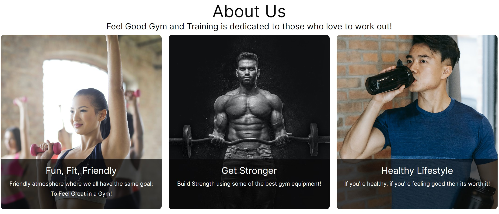
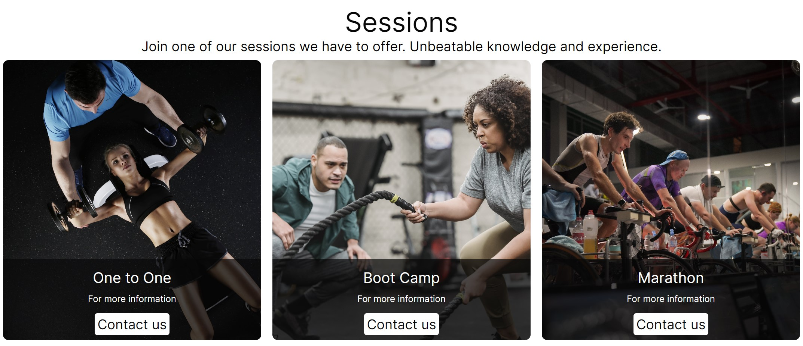
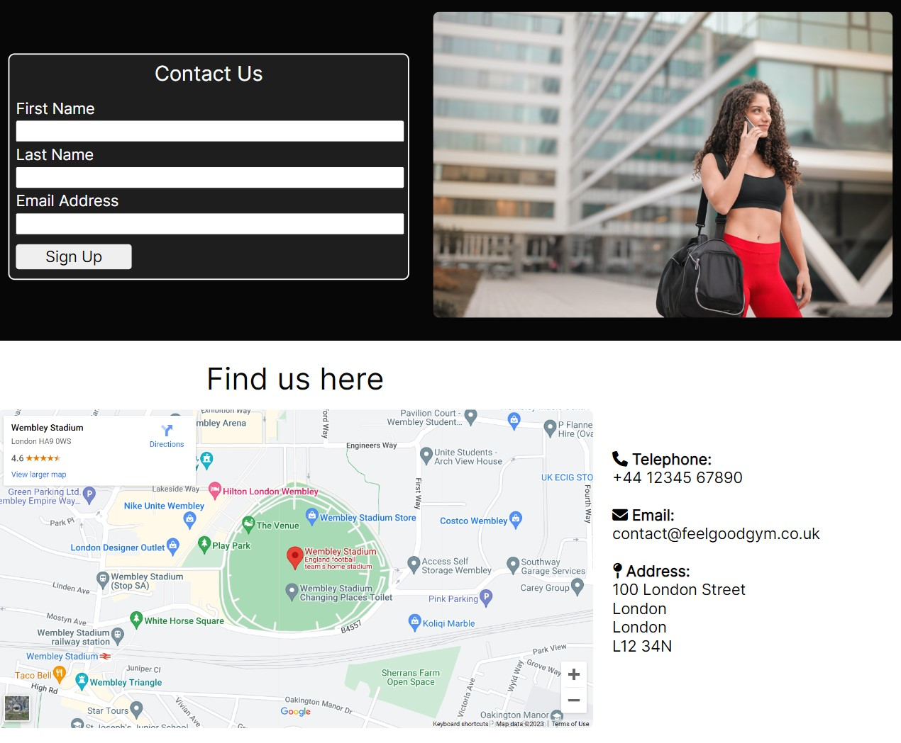

# Feel Good Gym and Training

[Feel Good Gym](https://joeyip13.github.io/Project-1-HTML-CSS/index.html) is designed as a portfolio for a gym website. Its goal is to highlight the gym and to create a motivational feel for wanting to sign up and become a member of the gym. 

## Table of Contents 

1. 

    
<a href="#ux">UX</a>

    <ul>
    <li>

    
<a href="#goals">Goals</a>

    - [Visitor Goals](#visitor-goals)
    - [Business Goals](#business-goals)
    - [User Stories](#user-stories)
    
</li>

    <li>

    
<a href="#visual-design">Visual Design</a>

    - [Figma](#figma)
    - [Logo](#Logo)
    - [Fonts](#fonts)
    - [Icons](#icons)
    - [Colors](#colors)
    - [Images](#images)
    - [Styling](#styling)
    
</li>
    </ul>

2. 

    
<a href="#features">Features</a>

    <ul>
    <li>

    
<a href="#page-elements">Page Elements</a>

    - [All Pages](#all-pages)
    - [Index Page](#index-page)
    - [About Page](#about-page)
    - [Memberships Page](#memberships-page)
    - [Sessions Page](#sessions-page)
    - [Contact Page](#contact-page)
    
</li>

    <li>

    
<a href="#feature-ideas">Feature Ideas</a>

    - [Future Feature Ideas](#future-feature-ideas)
    
</li>
    </ul>

3. 

    
<a href="#testing">Testing</a>

    <ul>
    <li>

    - [Validation](#validation)
    - [General Testing](#general-testing)
    - [PageSpeed Insights](#pagespeed-insights)

    </li>
    </ul>
    

4. 

    
<a href="#deployment">Deployment</a>

    <ul>
    <li>

    - [GitHub](#git-hub)

    </ul>
    </li>
    

5. 

    
<a href="#credits">Credits and Contact</a>

    <ul>
    <li>

    - [Credit](#credit)
    - [Content](#content)
    - [Media](#media)
    - [Contact](#contact)

    </ul>
    </li>
    

----

# UX 
## Goals 
### Visitor Goals 
The target audience for Feel Good Gym and Training are:
- People who are in search of a gym. 
- People who are interested in different courses the gym offers. 
- People who are looking to feel good about themselves by going for a workout.

### Business Goals 
The Business Goals of Feel Good Gym and Training are:
- Gain members through the contact page. 
- Gain interest and connect through social media platforms. 
- Advertise a unique feature that other gyms may not offer, I.e Boot Camps, Marathon, One to One.  

### User Goals 
User Goals are: 
- Display a clean easy to navigate website. 
- Easy to find pricing structure for signing up.
- What unique courses/sessions the gym has to offer.  

### User Stories
1. As a user interested in working out at a gym, I expect to see an easy to ready pricing structure.
0. If I was to sign up and become a member, I expect to know where.
0. Location of the gym and contact details should I have further questions about the gym. 
0. Some clear photos of the gym facilities.
0. What the gym has to offer that is unique to them. 
0. Main goal purpose for the gym. 
0. Follow the gym updates and offers they may have to offer through social media.

## Visual Design
### Figma
Figma was used in this process to help layout the structure and design of the website. 

For desktop:

For Mobile:

### Logo
Adobe Express was used to create the logo. From my prespective, I like the way visual images can instantly convey what a website is about. This is why I decided to create a logo of representation of Feel Good Gym and Training.   

### Fonts 
- Primary font was Inter 400. I chose this font because it showed a neutral, plain but informative feel. This font also worked well against the colour scheme. 

### Icons

- Icons are taken from the [Font Awesome](https://fontawesome.com/) Icon library and are utilised as classes in the `<i>` tag.
- Icons are utilised in the footer for social media links and the "top arrow" take the user back to the top menu page.

### Colors 

- I wanted the site to maintain a minimal aesthetic, colours are very basic and clean for highlighting the photos.
The primary colour used is black. With some contrasting grey which helps highlight certain areas of content on the webpage. White was used to offset the black. The use of the colours was to help with the overall layout of the page, initially on desktop it was to break up different sections of the page. 
- Text was used either black or white depending on the back ground colour of the page. I wanted it to be a good contrast between the pages. 

### Images

- All images are taken from Pexels. These images are consistent in style and colour to the website. 
- Images are responsive. For desktop they align in a row across the desktop and as the screen becomes smaller the images stack ontop of one another. 

### Styling 
- For this project I primarily used HTML and CSS to structure and style the website. 

----

# Features
## Page Elements
### All Pages
#### Navigation Bar

    
    

- Featured on all five pages, the full responsive navigation bar includes links to the Logo, About, Memberships, Sessions, Contact page and is identical in each page to allow for easy navigation.
- This section will allow the user to easily navigate from page to page across all devices without having to revert back to the previous page via the ‘back’ button.
- The Navigation Bar is simple keeping to the theme of the website. 
- Each link is categorised for easy to navigate through the website. 
- The Navigation bar will highlight when the cursor is hovered over the link for a nice user experience.
- The Navigation text will highlight bold when on that particular page, to identify which page the current user is on. 
- For Mobile the logo will remain central on top of the screen and the nav bar will stack below for the user to easily scroll through with one hand. 
- I used CSS Flexbox in the navigation bar in the media queries to give a responsive navigation bar.

### Footer

    
    

- The footer remains the same style on desktop and mobile to keep the consistency. 
- Consist of a "top arrow" icon to help the user return to the top of the page. 
- Social media links are located in the footer. 

### Index Page
#### Hero Section

    

- The index page includes an image and a content box aligned next to each other with a link that will take them directly to the contact page to sign up.
- This displays a clear message from what the website is about. 
- I used CSS Flexbox here to help center the content in the center of the background container. 

### About Page

    

- Three card layout is used to display the images and content used to describe "about us".
- A black transparent background behind the card's content helps emphasise the content. 
- The three cards are responsive and will stack ontop of another when the screen size becomes smaller for mobile viewing.
- Images used are consistent with the subject content. 
- I used CSS Flexbox in the About section to align the cards in a row and give a responsive layout.

### Memberships Page

    

- Three card layout is used to display the content cards. This is keeping with the same design as the About Us Page.
- Each card has a link to sign up which takes the user to the contact page. 
- The three cards are responsive and will stack ontop of another when the screen size becomes smaller for mobile viewing.

### Sessions Page

    

- Three card layout again is used to display the content cards. This is keeping with the same design as the About Us and Memberships page. 
- A black transparent background behind the card's content helps emphasise the content. 
- Each card has a link to the contact page.
- The three cards are responsive and will stack ontop of another when the screen size becomes smaller for mobile viewing.

### Contact Page

    

- This page will allow the user to get signed up to Feel Good Gym and Training or take them to the contact page for more information. 
- The user will be asked to submit their full name and email address.
- Page is broken down into two sections the contact form section and the location section. I've used a black back ground for the contact form section and a white background for the location section for a much better contrast on the page. 
- The interactive location map highlights the location of the gym so users can easy find the gym.
- Contact information along side the location map so user can easy find the contact details. 

### Feature Ideas
#### Future Feature Ideas
- Another feature idea would be to make for desktop viewing, the user can see all the pages in one single page.
- Links will be amended to jump from areas of the page. 

----

# Testing 
## Validation

- HTML has been validated with [W3C HTML5 Validator](https://validator.w3.org/).
- CSS has been validated with [W3C CSS Validator](https://jigsaw.w3.org/css-validator/)
- Links checked with [W3C Link Checker](https://validator.w3.org/checklink)

## PageSpeed Insights

    

- Tested performance on PageSpeed Insights [PageSpeed Insights](https://pagespeed.web.dev/)

## General Testing

- Each time a feature was added, all the functions were tested to see if there was an impact.
- The site was sent to friends for feedback and testing.
- All forms have validation and will not submit without the proper information.
- .gitignore file has been included to prevent system file commits.

----

# Deployment
## Git Hub

- The site was deployed to GitHub pages. The steps to deploy are as follows: 
- In the GitHub repository, navigate to the Settings tab 
- From the source section drop-down menu, select the Main Branch
- Once the main branch has been selected, the page will be automatically refreshed with a detailed ribbon display to indicate the successful deployment. 

The live link can be found here - https://github.com/JoeYip13/Project-1-HTML-CSS/settings/pages

---- 

# Credits 

- Code Institute - [Code Institute](https://github.com/Code-Institute-Org/gitpod-full-template)
I used Code Institute gitpod full template and HTML and CSS Essentials in the Full Stack Development course.
- W3 Schools - [W3 Schools](https://www.w3schools.com/)
- README.md for the template - https://github.com/Code-Institute-Solutions/readme-template
- Rory Patrick Sheridan README.md to help with structure content in my README.md - https://github.com/Ri-Dearg/horizon-photo/blob/master/README.md#page-elements
- Kevin Powell on YouTube - [Kevin Powell](https://www.youtube.com/@KevinPowell)
- Web Dev Simplified on YouTube - [Web Dev Simplified](https://www.youtube.com/@WebDevSimplified)

## Content 

- The hero content text is a quote from Mahatma Gandhi.
- The remaining content was generated from myself.
- The icons in the footer were taken from [Font Awesome](https://fontawesome.com/)

## Media

- All images used are from Pexels - https://www.pexels.com/
- The location map used is from Google Maps - https://www.google.co.uk/maps/@22.0382004,55.2604116,4z

